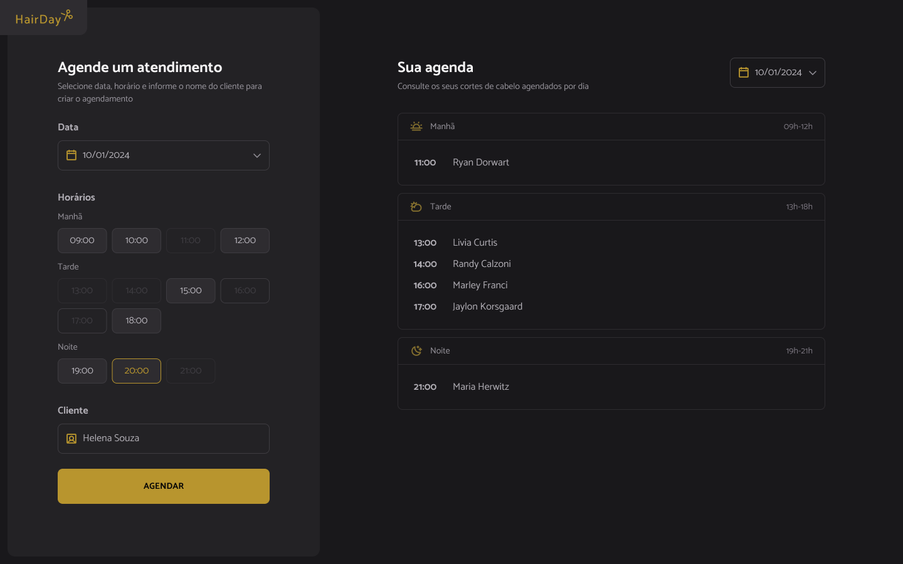

# 💈 HairDay — Plataforma de Agendamento de Cortes

**HairDay** é uma aplicação web focada em **agendamento de cortes de cabelo de forma simples, rápida e visual**.  
O projeto permite visualizar horários disponíveis, agendar atendimentos e organizar a agenda diária, oferecendo **controle claro do fluxo de atendimentos**.

A proposta central é unir **boa experiência de uso**, **organização correta de datas e horários** e **boas práticas de front-end**, sendo ideal tanto para uso conceitual quanto como **projeto de estudo em JavaScript moderno**.

---

## 🧭 Sobre a Aplicação

A aplicação foi desenvolvida com foco em **clareza e usabilidade**, permitindo que o usuário realize agendamentos rapidamente, sem fluxos confusos ou etapas desnecessárias.

O layout prioriza:
- **Hierarquia visual clara**
- **Feedback imediato** ao criar ou remover agendamentos
- **Tratamento correto de datas e horários**
- **Fluxo intuitivo de marcação de horários**

Toda a lógica da aplicação é executada no **front-end**, consumindo dados de uma **API simulada**.

---

## 📋 O que a Aplicação Permite

- 📅 **Visualizar horários disponíveis**
- ✂️ **Agendar cortes de cabelo** por data e horário
- 🧑‍💼 **Registrar nome do cliente** no agendamento
- ❌ **Cancelar agendamentos individualmente**
- ⏱️ **Organizar automaticamente a agenda diária**
- 🔄 **Atualizar a interface dinamicamente** com base nos dados da API

---

## ⚙️ Tecnologias Utilizadas

O projeto foi desenvolvido utilizando ferramentas modernas do ecossistema front-end:

- **JavaScript (ES6+)**
- **Webpack** — empacotamento e organização do projeto
- **Babel** — compatibilidade com navegadores
- **Day.js** — manipulação e formatação de datas
- **JSON Server** — simulação de API REST
- **HTML5 & CSS3**

Toda a lógica de estado, consumo de dados e atualização da interface é feita com **JavaScript puro**, utilizando manipulação direta do DOM.

---

## 🎯 Objetivos do Projeto

- Praticar **JavaScript moderno**
- Trabalhar **consumo de API simulada**
- Aplicar **organização de código com Webpack**
- Garantir **lógica correta de datas e horários**
- Desenvolver uma aplicação de **agendamento realista**

---

## 🖥️ Preview

